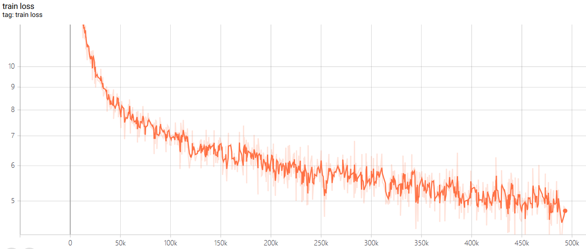
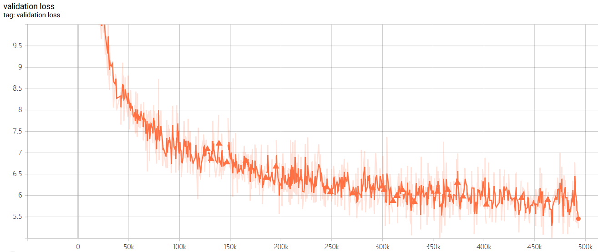
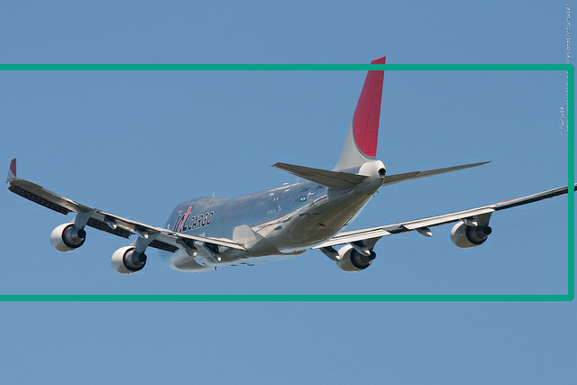
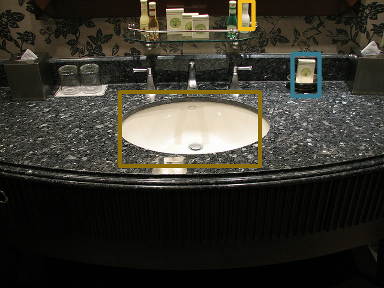
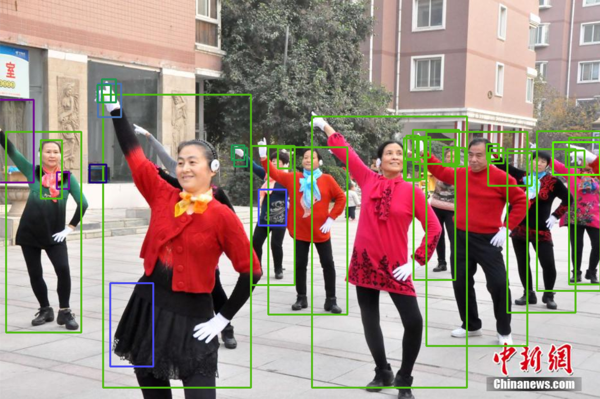

# YOLOv3-tf2.0

YOLOv3 implemented with tensorflow 2.0

### how to train on MS COCO 2017

download COCO2017 dataset from [here](https://cocodataset.org/). unzip directory train2017, val2017 and annotations. generate dataset with the following command.

```python
python3 create_dataset.py </path/to/train2017> </path/to/val2017> </path/to/annotations>
```

upon executing the script successfully, there will be directories named trainset and testset under the root directory of the source code.

then train the model by executing the following command

```Bash
python3 train_eager.py
```
or
```Bash
python3 train_keras.py
```

here are some results of my model which can be downloaded [here](https://pan.baidu.com/s/1QEqUUsRhHmUMij-jyA2EFg) with password mvvj. I trained YOLO v3 from scratch for 500k iterations with batch size 8 on a single gtx 1080 ti. which is far from the quality of the official darknet model which was trained on four gtx1080 for 500k iterations. I show my result here anyway.

<p align="center">
  <table>  
    <caption>Loss</caption>
    <tr><td></td></tr>
    <tr><td></td></tr>
  </table>
</p>
<p align="center">
 <table>
    <caption>Detection results</caption>
    <tr>
      <td></td>
      <td></td>
    </tr>
    <tr>
      <td></td>
      <td></td>
    </tr>
  </table>
</p>

### how to predict with the trained model

detect objects in an image by executing the following command

```bash
python3 Predictor.py <path/to/image>
```

### how to train YOLOv3 on your own data

compose label file in the following format.

```text
<path/to/image1> <target num>
<x> <y> <width> <height> <label>
<x> <y> <width> <height> <label>
...
<x> <y> <width> <height> <label>
<path/to/image2> <target num>
...
```

generate tfrecord file by executing the following command.

```bash
python3 create_dataset.py <path/to/annotation>
```

the script will generate trainset.tfrecord and validationset.tfrecord.

read the tfrecord with following code.

```python
from create_dataset import parse_function_generator;
trainset = tf.data.TFRecordDataset('trainset.tfrecord').map(parse_function_generator(num_classes = num_classes)).repeat(100).shuffle(batch_size).batch(batch_size).prefetch(tf.data.experimental.AUTOTUNE);
```

